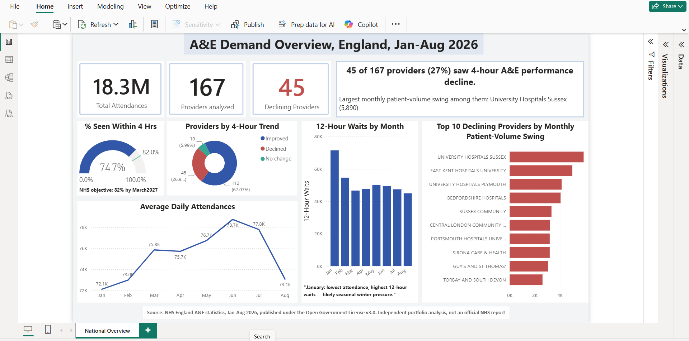

# NHS England A&E Capacity Strain Analysis

A SQL + Power BI case study analyzing hospital capacity signals using real NHS England A&E statistics (Jan–Aug 2026), from an operations/PMO perspective.

**Live demo:**

---

## Overview

Hospital A&E departments publish real, public attendance and performance data every month. This project asks: can that data be used to flag which hospital trusts are showing signs of capacity/resourcing strain — without any direct staffing data?

Using SQL for data cleaning and transformation, and Power BI for modeling and visualization, this analysis identifies trusts showing both declining 4-hour performance and high demand volatility — a combined signal worth investigating further from a resourcing standpoint.

## Data Source

- **Source:** [NHS England – A&E Attendances and Emergency Admissions Statistics](https://www.england.nhs.uk/statistics/statistical-work-areas/ae-waiting-times-and-activity/)
- **Period:** January–August 2026, 167 hospital trusts/providers
- **License:** Published under the [Open Government Licence v3.0](https://www.nationalarchives.gov.uk/doc/open-government-licence/version/3/) — free to reuse with attribution.
- This is an independent portfolio analysis and is **not** an official NHS report or endorsed by NHS England.

## Tools Used

- **SQL** (DB Browser for SQLite) — data cleaning, transformation, aggregation, and analysis
- **Power BI Desktop** — data modeling, DAX measures, dashboard design

## Approach

1. Combined 8 monthly CSV releases into a single SQL table
2. Cleaned the data — removed England-wide summary rows, standardized inconsistent capitalization, fixed chronological sorting
3. Calculated total attendances and 4-hour breach rates per trust per month
4. Built a January vs. August performance comparison per trust
5. Calculated demand volatility (both relative ratio and absolute patient-volume swing) per trust
6. Combined both signals to flag trusts showing both declining performance and high volatility
7. Modeled the cleaned data in Power BI and built an interactive one-page dashboard with DAX measures for daily-average demand and 4-hour performance

See [`queries.sql`](queries.sql) for the full SQL used.

## Key Findings

1. **Raw totals can mislead.** Monthly totals suggested July as the busiest month, but normalizing for the number of days in each month showed June actually has the highest *daily* attendance rate (78,742/day) — a seasonality correction that changes the headline finding.
2. **27% of providers show declining performance.** 45 of 167 providers saw their 4-hour A&E performance decline between January and August 2026, against an England-wide average of ~74.7% seen within 4 hours (vs. the NHS's 2026/27 objective of 82%).
3. **Volatility alone doesn't predict decline.** The providers with the single highest attendance swings overall (e.g., University Hospitals Birmingham, 16,615) actually *improved* performance despite the swing — demand volatility and declining performance don't always go together.
4. **University Hospitals Sussex shows the strongest combined signal** — a 5,890-patient monthly swing paired with declining 4-hour performance, the top result among providers showing both patterns at once.
5. **January shows a volume-independent strain signal.** January had the *lowest* average daily attendance (72,119) of the period, yet the *highest* count of 12+ hour waits (71,571) — well above June's 49,466, despite June having the highest attendance. This suggests factors other than patient volume alone (consistent with known seasonal "winter pressure") are driving the most severe waits.

## Limitations

- This dataset does not include actual staffing numbers. Findings describe patterns *consistent with* possible capacity/resourcing strain, based on attendance, performance, and wait-time proxies — not a direct measurement of staffing levels.
- A small number of providers had incomplete reporting across the 8-month period and were excluded from trend comparisons.

## Files in this repo

- `dashboard.png` — dashboard screenshot
- `Analysis A&E.gif` — short interactive walkthrough
- `queries.sql` — full SQL used for cleaning, transformation, and analysis

---

**Connect:** [LinkedIn]((https://www.linkedin.com/in/deepthisinghrathod/)) | Related project: [IT Staffing Resource Deployment Analytics ((https://github.com/Deepthi16-r/staffing-analytics-case-study))
